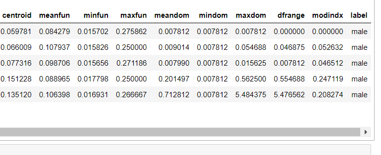
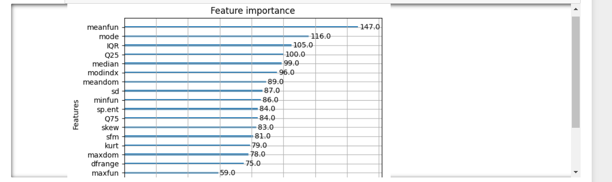
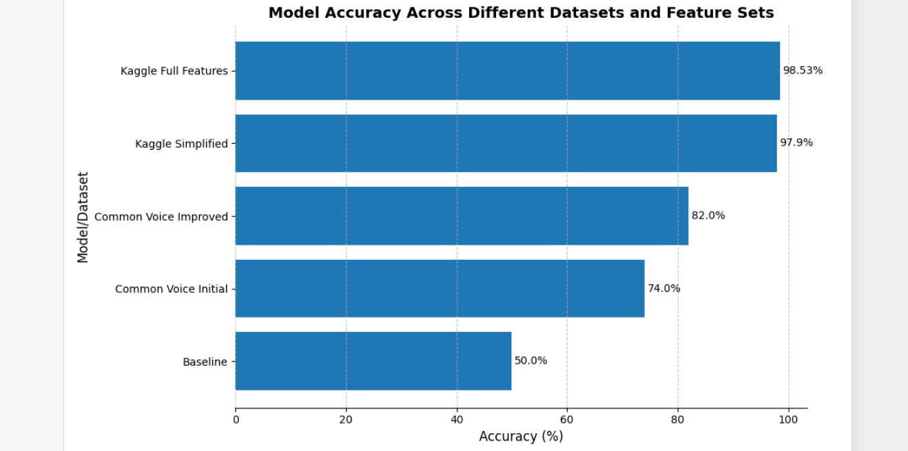

# Gender Indetification by voice

## Executive Summary

This project explores the development of an automated gender classifier using machine learning techniques to improve data balance and mitigate biases in audio datasets. By accurately identifying the speaker's gender, this solution enhances the fairness and representativeness of datasets, benefiting various applications such as speech recognition and beyond. This classifier helps organisations improve model performance and adhere to ethical standards in AI development.

## Data Preprocessing
The data analysis process begins by exploring a ["Kaggle dataset"](https://www.kaggle.com/datasets/primaryobjects/voicegender/data) with 20 audio features and a gender label. The dataset is pre-cleaned and standardized, simplifying initial analysis. After loading and inspecting the dataset using Python and Pandas, the goal is to ensure it meets model training conditions. A benchmark accuracy of 50% is set by predicting the majority class ("male") in a balanced dataset, providing a baseline for evaluating any machine learning models developed.

## Initial Exploration
Using Python and Pandas, I will load and inspect the dataset to ensure it meets the necessary conditions for model training.
```python
kaggle_data = "voice.csv"
df = pd.read_csv(kaggle_data)
df.head()
```


## Model Selection and Justification
For the modeling process, I chose XGBoost as the primary algorithm due to its proven performance and my familiarity with it. XGBoost has demonstrated high accuracy on this dataset, as highlighted by ["Primary Object"](https://www.primaryobjects.com/2016/06/22/identifying-the-gender-of-a-voice-using-machine-learning/) article, and I have experience tuning and optimizing it for various tasks. While CART models are also effective, my current expertise with them is limited. However, I plan to explore and implement CART models in future iterations to enhance the model and further develop my data science skills.

## Model Training
```python
import pandas as pd
import xgboost as xgb
from sklearn.model_selection import train_test_split
from sklearn.metrics import accuracy_score
from sklearn.preprocessing import LabelEncoder

# Load data
df = pd.read_csv('voice.csv')

# Preprocess data
label_encoder = LabelEncoder()
df['label'] = label_encoder.fit_transform(df['label'])  # Convert labels to 0 and 1

# Split data into features and target
X = df.drop('label', axis=1)
y = df['label']

# Split data into train and test sets
X_train, X_test, y_train, y_test = train_test_split(X, y, test_size=0.3, random_state=777)

# Define the model
params = {
    'objective': 'binary:logistic',
    'eta': 0.2,
    'subsample': 0.5,
    'colsample_bytree': 0.5,
    'eval_metric': 'logloss'  # Focus on log loss as your evaluation metric
}

num_boost_round = 500

# Train the model
dtrain = xgb.DMatrix(X_train, label=y_train)
model = xgb.train(params, dtrain, num_boost_round)

# Predict on test set
dtest = xgb.DMatrix(X_test)
y_pred = model.predict(dtest)
predictions = [1 if value >= 0.5 else 0 for value in y_pred]

# Evaluate predictions
accuracy = accuracy_score(y_test, predictions)
print("Accuracy: %.2f%%" % (accuracy * 100.0))
```
This achieves an accuracy of 98.53%

## Feature Engineering and Model Development
The original Kaggle data achieved an amazing 98.53% accuracy. However, the original analysis lacked transparency regarding the source of the audio features, as the features were extracted using R libraries such as ["WarbleR"](https://www.rdocumentation.org/packages/warbleR/versions/1.1.32), which poses a challenge for reproducibility, especially when working with new datasets.

Given this limitation, I conducted a feature importance analysis using XGBoost. This analysis revealed that the “meanfun” feature, which represents the mean fundamental frequency, was the most critical predictor of gender. Remarkably, a model trained solely on “meanfun” achieved an accuracy of 94.74%.
```Python
import xgboost as xgb
from xgboost import plot_importance
import matplotlib.pyplot as plt

plot_importance(model, importance_type='weight')
plt.show()
```


Further training using the top four features (“meanfun,” “mode”, “IQR”, and “Q25”) resulted in an accuracy of 97.9%, which is only slightly lower than the accuracy achieved using all 20 features. This demonstrates that a more streamlined model using fewer features can still perform exceptionally well, with minimal loss in accuracy.

## Replication and Validation with Common Voice Dataset
To ensure the robustness and generalisability of the model, I applied the feature extraction process to a new dataset sourced from Common Voice, an open-source project with a diverse collection of audio recordings. The dataset was filtered to include 4,000 files (2,000 male and 2,000 female) for balanced training. Feature extraction was performed in Python, focusing on the four key features identified earlier.
The initial model trained on this dataset achieved an accuracy of 74%, which, while better than random guessing, falls short of the performance observed with the Kaggle dataset. 
I then added noise removal in the code achieving an accuracy score of 82% for this Common Voice data.
```Python
import os
import numpy as np
import librosa

def calculate_features(audio_file, threshold=5, fmax=280, wl=2048, max_duration=20):
    # Load only the first max_duration seconds of the audio file
    y, sr = librosa.load(audio_file, duration=max_duration)
    
    # Remove silence from the audio signal
    y = remove_silence(y, sr)
    
    # Short-Time Fourier Transform (STFT)
    S = np.abs(librosa.stft(y, n_fft=wl))
    
    # Compute power spectral density (PSD)
    psd = np.mean(S**2, axis=1)  # Mean power across all time frames
    
    # Frequency spectrum in Hz
    frequencies = librosa.fft_frequencies(sr=sr, n_fft=wl)
    
    # Calculate power-weighted IQR and Q25
    cumulative_power = np.cumsum(psd) / np.sum(psd)  # Cumulative sum of power (normalized to 1)
    
    Q25_idx = np.where(cumulative_power >= 0.25)[0][0]  # Index where cumulative power exceeds 25%
    Q75_idx = np.where(cumulative_power >= 0.75)[0][0]  # Index where cumulative power exceeds 75%
    
    Q25 = frequencies[Q25_idx] / 1000  # Convert to kHz
    Q75 = frequencies[Q75_idx] / 1000  # Convert to kHz
    IQR = (Q75 - Q25)  # Interquartile range in kHz
    
    # Find the frequency corresponding to the maximum power (mode frequency)
    modefreq = frequencies[np.argmax(psd)] / 1000  # Convert to kHz
    
    # Fundamental Frequency Calculation
    pitches, magnitudes = librosa.core.piptrack(y=y, sr=sr, fmax=fmax)
    
    # Thresholding
    pitches = pitches[magnitudes > threshold]
    
    # Fundamental frequency (in kHz)
    if len(pitches) > 0:
        meanfun = np.mean(pitches[pitches > 0]) / 1000  # Convert to kHz
    else:
        meanfun = 0
    
    # Return results as a dictionary
    return {
        "filename": os.path.basename(audio_file),
        "meanfun": meanfun,
        "IQR": IQR,
        "modefreq": modefreq,
        "Q25": Q25
    }

def remove_silence(y, sr, top_db=20):
    # Trim leading and trailing silence from an audio signal
    yt, _ = librosa.effects.trim(y, top_db=top_db)
    return yt

def process_directory(directory, output_csv):
    # List to store all results
    results = []
    
    # Loop through all .wav files in the directory
    for filename in os.listdir(directory):
        if filename.endswith(".wav"):
            filepath = os.path.join(directory, filename)
            # Calculate the acoustic parameters
            try:
                result = calculate_features(filepath)
                results.append(result)
            except Exception as e:
                print(f"Error processing {filename}: {e}")
    
    # Write results to a CSV file
    with open(output_csv, 'w', newline='') as csvfile:
        fieldnames = ["filename", "meanfun", "IQR", "modefreq", "Q25"]
        writer = csv.DictWriter(csvfile, fieldnames=fieldnames)
        
        # Write header
        writer.writeheader()
        
        # Write each result to the CSV
        for row in results:
            writer.writerow(row)
    
    print(f"Processing complete. Results saved to {output_csv}")

# Example usage:
directory = 'audio_data'  # Directory containing your .wav files
output_csv = 'output_full.csv'  # Name of the output CSV file

process_directory(directory, output_csv)
```


## Reflection and Future Improvements
This analysis underscores the importance of feature selection, data preprocessing, and model choice in building an effective gender classification model. Although XGBoost proved robust, our model's 82% accuracy fell short of the higher accuracy achieved by a Kaggle dataset, possibly due to differences in techniques and dataset composition. The smaller and potentially mislabeled Common Voice dataset may have impacted results. Future improvements could include refining feature extraction, expanding the dataset, and exploring alternative models. Despite limitations, the model developed achieves 82% accuracy, providing a useful tool for gender-based dataset filtering.

## References
["Kaggle dataset"](https://www.kaggle.com/datasets/primaryobjects/voicegender/data)
["Primary Object Document"](https://www.primaryobjects.com/2016/06/22/identifying-the-gender-of-a-voice-using-machine-learning/)
["R Library WarbleR"](https://www.rdocumentation.org/packages/warbleR/versions/1.1.32)